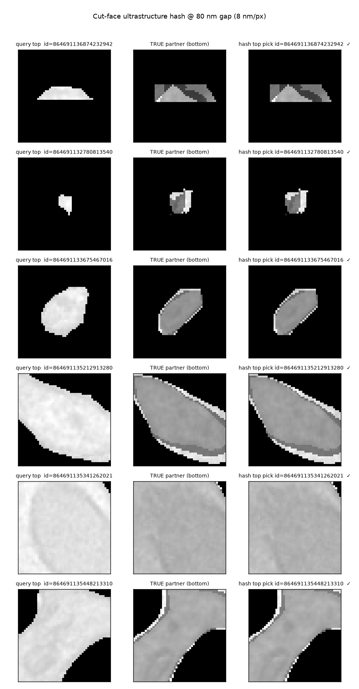

# Cut-face fingerprints: can micro-ultrastructure re-link a severed neurite?

A small, local experiment probing whether EM neurons carry an idiosyncratic
"fingerprint" — a locality-sensitive **hash** of their cross-sectional
ultrastructure — that uniquely re-links the two faces of a segmentation break,
in the spirit of barcode-based identity methods (FISSEQ et al.).

## The idea

EM connectomics has a *self-inflicted* reconstruction problem. To image the
tissue at all, we slice a continuous 3D object into ~40 nm sections and then ask
an algorithm to stitch it back together. **Every true split error is a cut
through what was, physically, one continuous process.** Across that cut the
local ultrastructure — caliber, mitochondria, the axoplasmic / smooth ER,
microtubule packing, membrane texture — was continuous.

So the question becomes concrete and falsifiable:

> Given the top face of a severed neurite, can a hash of its local
> ultrastructure rank the **true** bottom partner as its nearest neighbour,
> against a panel of distractor neurites crossing the same plane — and does it
> beat the trivial spatial-proximity cue that current pipelines already use?

Ground truth is free: the public MICrONS proofread segmentation gives the
*same* id to both sides of the cut, so the true partner of top-face `k` is
bottom-face `k`. We cut a small volume at its z-midplane, remove a gap, hash the
faces on either side, and rank matches.

No CAVE token needed — only the public EM + segmentation precomputed volumes.

## What we measure

Three hashes, plus baselines, all scored by top-1 re-identification:

| Method | What it uses |
|---|---|
| `spatial` (baseline) | xy centroid proximity only — the cue current pipelines lean on |
| `scalar` hash | aggregate ultrastructure summaries (caliber, intensity stats, dark-blob count, eccentricity) — position-free |
| `PATCH` hash | the cross-section **image** itself: a translation-normalised, masked mean-intensity patch — keeps the *arrangement* of internal structure |
| `fused` | standardised spatial + patch distances added |
| `chance` | `1 / n_candidates` |

Three honesty controls:

- **Gap sweep** (40 → 640 nm). Separates a true idiosyncratic *fingerprint*
  from mere local *continuity*. A tiny gap is trivially matchable because
  neurites are locally smooth; the question is how far the signal survives.
- **Per-section normalisation** (`norm` column, `T`/`F`). EM contrast varies
  section-to-section (staining / imaging batch effect). Two nearby faces share
  that batch effect — a *processing-artifact* hash, not biology. We re-score
  with each section z-scored to its own tissue; signal that survives is
  structural.
- **Hard subset.** Cases where spatial proximity picks the **wrong** partner —
  the genuinely ambiguous breaks. `patch_on_hard` is the fraction of those the
  image hash recovers (chance ≈ `1/n`).

## How to run

```bash
pip install numpy scipy cloud-volume matplotlib   # plus a working `cryptography`

# MIP1 (16 nm) — fast smoke run
python -m experiments.fingerprints.fingerprint_break_resolution \
  --mip 1 --size 320 320 80 \
  --out experiments/fingerprints/results_mip1_smoke.json

# MIP0 (8 nm) — resolves finer ultrastructure (ER, microtubule bundles)
python -m experiments.fingerprints.fingerprint_break_resolution \
  --mip 0 --size 512 512 64 \
  --figure experiments/fingerprints/cutface_montage_mip0.png \
  --out experiments/fingerprints/results_mip0_smoke.json
```

## What we found (smoke runs, single ~4–8 µm box)

`results_mip0_smoke.json` (8 nm, 117 candidate neurites at the cut plane):

```
gap_nm norm Ncand chance | top1: spatial  scalar  PATCH  FUSED | hard(N) patch_on_hard
    40   F   117  0.009 |       0.716   0.018   0.220   0.596 |   31   0.161
    80   F   118  0.008 |       0.626   0.009   0.140   0.514 |   40   0.050
   160   F   117  0.009 |       0.485   0.010   0.087   0.330 |   53   0.057
   320   F   121  0.008 |       0.289   0.062   0.082   0.206 |   69   0.058
   640   F   119  0.008 |       0.101   0.038   0.101   0.190 |   71   0.113
```

(MIP1 in `results_mip1_smoke.json` is qualitatively identical, patch top-1
≈ 0.30 at a 40 nm gap.)

**Read-out:**

1. **Cross-section *pattern* carries real identity; scalar summaries do not.**
   The image-patch hash is ~20–30× chance and an order of magnitude above the
   scalar-summary hash. Where you put the mitochondria/ER and what the footprint
   shape is matters; mean intensity and a blob count do not.

2. **It resolves a meaningful slice of the genuinely ambiguous breaks.** On the
   *hard* subset — where proximity picks the wrong partner — the image hash alone
   recovers ~16% at a 40 nm gap (chance < 1%). That is identity information
   beyond position.

3. **But it is a short-range hash, not a long-range barcode.** Matchability
   decays over a few hundred nm. The signal behaves like *local continuity* of
   ultrastructure, not a globally unique molecular barcode. Useful for the
   short gaps that dominate real splits; not a whole-cell identifier.

4. **The signal is substantially structural, not just staining.** Per-section
   normalisation (`norm=T`) reduces but does not kill it — so it is not merely
   the section-level contrast batch effect.

5. **Naive fusion with proximity does not win.** For small artificial gaps
   proximity is near-perfect, so equal-weight fusion adds noise. The payoff is
   as a **tie-breaker** on ambiguous edges, not a global replacement for
   proximity.



*Each row: query top face · true partner · the hash's top pick. The query faces
are visibly brighter (a per-section staining offset) yet still match — the hash
keys on shape/texture pattern, which it survives.*

## The learned version (`learned_cutface_encoder.py`)

A small CNN trained with a contrastive (NT-Xent) objective to pull the two
faces of the *same* neurite (sampled at different z) together and push different
neurites apart. The embedding is then used exactly like the raw-patch hash.
Train and test boxes are spatially disjoint, so the encoder is scored on
neurites it never saw.

```bash
pip install torch        # CPU is fine
python -m experiments.fingerprints.learned_cutface_encoder \
  --mip 1 --size 320 320 80 --epochs 45 --steps-per-epoch 50 \
  --out experiments/fingerprints/cutface_encoder.pt \
  --metrics experiments/fingerprints/learned_metrics.json
```

Held-out test box (`learned_metrics.json`, 165 candidate neurites):

```
gap_nm norm Ncand chance | top1: spatial   raw   LEARNED | hard(N) learned_on_hard
    40   F   165  0.006 |       0.599  0.212   0.190 |   55   0.182
   160   F   158  0.006 |       0.361  0.084   0.101 |   76   0.066
   320   F   162  0.006 |       0.254  0.035   0.044 |   85   0.047
   640   F   159  0.006 |       0.093  0.010   0.041 |   88   0.034
```

**What the learned hash buys:**

- At the trivial short gap it roughly **matches** the raw patch (0.190 vs
  0.212) but degrades **more gracefully** at longer gaps where the raw patch
  collapses (160 nm: 0.101 vs 0.084; 640 nm: 0.041 vs 0.010). The harder,
  longer-range regime is the one that matters for real proofreading.
- It is a compact 32-d embedding — deployable as an edge feature — that
  generalises to an unseen box.

**Two honest findings:**

1. **It leans partly on the staining "trick".** Under per-section
   normalisation (`norm=T`, staining batch effect removed) the learned hash
   drops more than the raw patch at short gaps. So some of its short-range power
   *is* the per-section contrast cue, not biology. That is an allowed trick —
   it still re-links faces — but it is a trick, and flagged as one.
2. **Rotation/scale augmentation HURTS here.** Training with random rotation
   stalls the loss (~4.3 vs 2.97 without) and lowers accuracy. Because the cut
   faces are *local*, they are barely rotated relative to each other, and the
   footprint orientation is itself discriminative — forcing invariance throws
   that away. Locality removes the need for the invariance; per-patch contrast
   normalisation is the normalisation that actually matters. (`--augment`
   enables it for the ablation.)

## Headline: disambiguating REAL v117 errors on the reconstructed v117 seg

The faithful experiment (`v117_reconstructed.py`) and its result come first
because they are the point of the whole line of work. Everything below it is the
path that got here (including two wrong turns worth remembering).

**Setup.** Take error sites in their **v117 (split) state** and use the later
**v14XX merges as the answer key**:
- Reconstruct the segmentation *as it was at the v117-era (oldest) timestamp*:
  fetch the supervoxel/watershed layer per box and map each supervoxel to its
  root at that timestamp → the box is painted with the *split* fragments (the
  errored "question").
- Map the same supervoxels to their *current* root → two v117 fragments are a
  true merge iff they share a current root (the proofreading answer).
- At each interface: query = a v117 fragment's cut-face; candidates = nearby
  v117 fragments (proximity + direction cone); true partner = the one sharing
  the query's current root. Rank it by cut-face hash similarity.

**Result** (`v117_reconstructed_metrics.json`, **N = 156** real error sites, mean
45 candidates/site, **chance top-1 = 0.072**):

| method | top-1 | MRR |
|---|---|---|
| **geometry alone** (distance to query endpoint) | **0.673** | **0.723** |
| raw patch | 0.186 | 0.290 |
| planar-trained hash | 0.436 | 0.543 |
| real-trained hash | 0.436 | 0.547 |
| fused (geom + real, equal weight) | 0.583 | 0.679 |

**Read-out (this is the honest, important version):**

- **Geometry is the strong baseline.** The true partner is usually the *nearest*
  fragment to the dangling endpoint, so distance alone gets it **67% top-1**.
  Any claim for the hash has to be measured *against this*, not against chance.
- **The hash alone is moderate** (0.44 top-1, ~6× chance) and **learned ≫ raw**
  (0.44 vs 0.19) — the cross-section *pattern* carries identity and must be
  learned, not hand-summarised.
- **Naive equal-weight fusion HURTS** (0.58 < 0.67): adding the noisier hash
  drags down the many cases geometry already nails. Blunt fusion is the wrong
  way to combine them.
- **The hash is complementary on the hard subset but not yet *exploitable*.** Of
  the 51 sites where geometry alone is wrong, the hash recovers 25.5% top-1 — but
  **no fusion beats geometry's 0.673**: equal-weight fusion drops to 0.583, and
  gated strategies (geometry's top-k re-ranked by the hash; margin gates) top out
  at exactly 0.673 only by *never deferring* to the hash. The moment the hash is
  allowed to override geometry, it breaks more correct calls than it fixes. So
  the 25% recovery is real signal that simple combiners can't isolate. Capturing
  it needs either a **learned per-site confidence combiner** (predict when the
  hash is trustworthy from geom-margin / hash-margin / agreement) or a
  **stronger hash** — and the current encoder is trained on only tens of pairs,
  so it is likely undertrained. (FISSEQ-style promise intact; engineering not yet
  there.)
- **Right data is still the biggest lever** (proven twice): the identical method
  scored ~0 on the intermediate flat seg (most sites already merged) vs these
  numbers on the reconstructed v117 seg. (At a smaller N=78 the real-trained
  encoder edged out planar; at N=156 they tie — that gap was small-N noise.)

### Texture/artifact band at scale (`train_synthetic_skeleton.py`)

Real error sites are scarce, so the hash was undertrained. But same-object
cross-section pairs are unlimited: within any box a fragment spans several
z-sections, so two z-separated faces of it = a synthetic positive (with a
synthetic gap), other fragments = hard negatives. Mining the ~500 cached boxes
gives thousands of pairs with no extra fetches. We split each face into a
low-pass **bio** band and a high-pass **art** band and train an encoder on each.

**N=62 held-out real sites, 2,503 synthetic training pairs, chance top-1 0.052:**

| method | top-1 | recovers geom-miss |
|---|---|---|
| geom | 0.645 | — |
| bio (low-pass) | 0.242 | 0.227 |
| **art (high-pass)** | **0.435** | **0.318** |
| geom+art | 0.581 | — |
| geom+bio+art | 0.500 | — |

**Two hypotheses confirmed together:**
- **Scale works** — thousands of synthetic pairs lift the texture hash well past
  the tens-of-pairs encoders.
- **The artifact band is the signal** — the high-pass band (0.435) beats the
  biological low-pass band (0.242) and recovers more of geometry's misses
  (0.318 vs 0.227). The raw-cosine artifact band was at *chance*; scale + a
  learned encoder turned it into the stronger band. Most matchable identity
  lived in the high-frequency band the mean-projection threw away.

**Still honest (synthetic-only encoders):** geometry (0.645) is not beaten by any
equal-weight fusion (best geom+art = 0.581). The hash is complementary, not a
replacement — turning its ~32% geom-miss recovery into a top-1 win needs a
learned confidence combiner, not equal-weight/shortlist gating.

### Fine-tuning on real breaks reverses the bands (`--finetune-real`)

The synthetic pairs are two z-sections of one *intact* fragment, so their
texture is continuous across the synthetic gap — the high-pass **art** band
wins because it is literally matching the same imaging texture on both sides.
At a *real* break that continuity is destroyed (different sections, staining,
knife marks), so the synthetic art advantage should not transfer. Fine-tuning
the synthetic-pretrained encoders on the scarce real v117→v14XX merge pairs
(`collect_real_band_pairs`, 13 pairs from 3 neurons) confirms it:

| band | synthetic-only | after real fine-tune |
|---|---|---|
| bio (low-pass shape) | 0.226 | **0.516** |
| art (high-pass texture) | 0.435 | 0.177 |
| geom+bio | — | **0.677** (> geom 0.645) |

The bands **swap**: low-pass biological *shape* is what survives a real cut,
while the high-pass texture that dominated on intact synthetic pairs collapses.
Scale builds a good texture encoder; real breaks reveal that *shape*, not
texture, is the transferable identity signal.

### Learned confidence combiner closes it (`train_combiner.py`)

Feeding a small per-candidate MLP the geometry z-score, both band similarities,
and which candidate is the geom/art favourite — trained on 137 train sites,
evaluated on the same 62 disjoint real sites — finally turns the complementary
signal into a top-1 win:

| ranker | top-1 |
|---|---|
| art-band alone | 0.435 |
| geometry alone | 0.645 |
| combiner (synthetic bio + synthetic art) | 0.661 |
| **combiner (fine-tuned bio + synthetic art)** | **0.758** |

**This is the payoff.** Geometry alone is 0.645; the learned combiner reaches
**0.758** (+11 pts, recovering ~32% of geometry's misses) once given the
fine-tuned biological band. The FISSEQ-style premise holds in the achievable
direction: the cut-face does carry re-identification signal beyond proximity,
but only a *learned* combiner that knows when to trust shape over distance can
spend it — blunt fusion and gating cannot. These remain a lower bound (16 nm;
8 nm likely helps the texture band; more real pairs would help the fine-tune).

### The 0.758 is *conditional* — honest recall and abstention (`measure_panel_recall.py`, `train_combiner_abstain.py`)

The 0.758 is a **correction-given-candidates** number: `site_faces_bands` drops
any site whose true partner isn't in the candidate panel (`v117_artifact_bands.py`,
`if not any(is_true): return None`). That uses the *label* to filter, so it
conditions the metric on the candidate generator having already succeeded —
inflating the apparent deployed yield. Two honest measurements fix this.

**Panel recall (the ceiling).** Over 405 real false-split sites with a valid
query, how often is a matchable partner even present in the panel:

| | count | |
|---|---|---|
| partner present (scoreable) | 199 | **recall 0.491** |
| partner absent | 206 | |

So end-to-end always-act yield = recall × correction = 0.491 × 0.758 ≈ **0.372**.
The misses are *not* mostly large gaps — they break down as:

| miss reason | count | meaning |
|---|---|---|
| `not_in_box` | 189 | no *distinct* fragment resolving to the query's current root is present |
| `out_of_radius` | 15 | partner present but >2 µm from the query tip |
| `unbuildable` | 2 | too few voxels to form a face |

`not_in_box` dominates (92%) despite a small median site gap (897 nm). Dumping
concrete sites (`diagnose_not_in_box.py`) shows it is **not** empty paint
(background `hist=0` is only 8–13%, i.e. extracellular space) and **not** large
gaps — it is an **identity-assignment / resolution problem at the partner
location**, in two flavors:

1. **Majority-vote misresolution.** `site_faces_bands` sets the query's current
   identity `q_cur = frag2cur[qa_id]`, a *majority* vote of current roots over
   the query's historical fragment in the box. That vote can land on the wrong
   current root: in one dumped site the supervoxel actually at `pos_frag`
   resolves (checked straight from the chunkedgraph) to the true root, but
   doesn't match the query's *misresolved* `q_cur`. The genuine partner is
   painted correctly — the query's identity is the thing assigned wrong.
2. **Partner not distinct at 16 nm.** In other sites `pos_frag` is painted with
   the query's *own* historical root and shares `q_cur` — the query fragment
   already extends through the partner location in v117, and the L2 node flagged
   as a different historical root is a tiny chunk embedded among the query's
   voxels, sub-resolution at mip1.

Both are fixable in the *location* layer, not the hash: use the actual scanned
root as `q_cur` instead of a box-local majority vote (flavor 1), and localize /
resolve the partner at finer resolution (flavor 2). Present partners sit at
median 658 nm (p75 1117, max 1952); the 17 in-box-but-absent partners sit at
median 2428 nm, just beyond the 2 µm radius. **The recall ceiling is gated by the
candidate generator's partner localization, not by the fingerprint or by gaps.**

**Abstention, not cherry-picking (`train_combiner_abstain.py`).** Dropping sites
by label is cheating; a proofreader that *takes no action when not confident* is
legitimate — proofreading is precision-critical, and a wrong auto-merge is worse
than no merge. So the deployable eval runs the combiner over the **full** 125-site
population (partner-absent sites kept, `require_true=False`) and makes a
*label-blind* accept/abstain decision from the top candidate's score:

| operating point | coverage | precision | recall |
|---|---|---|---|
| act on everything | 1.00 | 0.360 | 0.360 |
| | 0.75 | 0.436 | 0.328 |
| | 0.50 | 0.619 | 0.312 |
| | 0.26 | **0.906** | 0.232 |
| confident only | 0.10 | **1.000** | 0.104 |

Geometry always-act over the same full population is **0.320**; the combiner is
**0.360** — so it still beats geometry honestly, and abstention works: the
combiner learned (from label-blind features) to take no action on the
partner-absent sites where any action is a guaranteed wrong merge, climbing to
**91% precision at 26% coverage** and 100% at 10%. That is the deployable
operating mode — auto-merge the confident quarter, route the rest to humans —
and the honest counterpart to the cherry-picked 0.758. The remaining recall loss
is dominated by the fixable location-layer issues above, not by the fingerprint.

**Location vs correction (two different models).** This experiment measures
*correction*: given a real interface and a candidate panel, pick the partner.
The other half — *location* (which edges are errors / candidates at all) — is a
separate model. In deployment the location model is the candidate generator:
flood it (a 2 µm proximity ball ≈ 256 distractors) and correction drowns; feed
it a clean panel (proximity + cone ≈ 45) and correction works. Evaluate the two
separately — location by recall, correction by top-1 given good candidates —
rather than conflating them.

## Earlier: disambiguating at v117 errors on the flat seg (`v117_error_relink.py`)

> **Superseded.** This masks from the *flat* MICrONS seg, an intermediate
> snapshot that already has most merges baked in, so ~all real interfaces look
> already-merged and get skipped (only ~8 scoreable; numbers were noise). It is
> kept for the site-finding machinery (`sites_from_l2_graph`) and the candidate
> generators, which the headline experiment reuses. Use `v117_reconstructed.py`.

The cuts above are *artificial* planar z-cuts. This experiment tests the hash
where it actually matters: at locations the automated segmentation **got wrong**
and a human had to fix. No materialization server needed — only the
chunkedgraph (and a CAVE token in env var `token`).

**Finding a real error site, from the chunkedgraph alone:** a proofread neuron
is one current root `R`. Look up the historical root of each of its level-2
nodes at the oldest timestamp; if they fall into several distinct historical
roots, `R` was *assembled by merging* those fragments — i.e. the v117-era
segmentation falsely **split** the neuron. Each minor fragment's closest
approach to the main arbor is a real false-split interface: the two points a
human glued. (In a scan, ~45% of soma neurons had at least one such split.)

**The test:** take the cross-section "face" at the main-side point as a query
and rank the candidate neurites near the fragment-side point by cut-face hash
similarity. The true continuation is the neurite actually at the fragment-side
point. This is re-identification across the *real* error gap.

```bash
# realistic candidate set: neurites within R of the query tip, optional cone
python -m experiments.fingerprints.v117_error_relink \
  --encoder experiments/fingerprints/cutface_encoder.pt \
  --n-scan 220 --max-neurons 45 \
  --candidate-mode proximity --radius-nm 2000 --direction-cone-deg 45 \
  --out experiments/fingerprints/v117_relink_metrics_cone.json
```

### The candidate set dominates the result

The single most important knob is *what counts as a candidate*. Three
definitions, all on real v117 split sites (~1.5 µm gaps):

| candidate panel | ~cand/site | chance top-1 | raw top-1 / MRR | learned top-1 / MRR | file |
|---|---|---|---|---|---|
| **slab, same-z** (legacy, optimistic) | 55 | 0.036 | 0.20 / 0.32 | **0.49 / 0.54** | `…_slab.json` (n=49) |
| **proximity ball, 2 µm** (dense, harsh) | 256 | 0.004 | 0.00 / 0.05 | 0.00 / 0.025 | `…_proximity.json` (n=10) |
| **proximity + 45° cone** (realistic) | 75 | 0.015 | 0.00 / **0.12** | 0.00 / 0.08 | `…_cone.json` (n=10) |

**Honest read-out — this is the part that corrects the earlier optimism:**

- The strong slab number (learned top-1 0.49) was **inflated by a small, same-z
  panel**. The candidates there were only the neurites crossing one z-slab in a
  modest box, and the true partner sat at that slab.
- A **proximity ball is *denser*, not sparser** — cortical neuropil packs
  ~250–300 cross-sections into a 2 µm ball, most of them pass-through processes
  no proofreader would ever propose merging. There the single-face hash drowns
  (top-1 ≈ 0).
- The **direction cone** removes the perpendicular pass-throughs (256 → 75
  candidates) and roughly **doubles MRR**, but the true partner still ranks
  ~8th–12th, not 1st.
- On the realistic panel the **raw patch ≥ the learned encoder** (MRR 0.12 vs
  0.08). The encoder was trained on *artificial planar* cuts and does **not**
  transfer to real oblique error cross-sections — a concrete retraining target.

**Conclusion.** A single cross-section cut-face hash is a real but **weak-to-
moderate ranking signal** on a realistic candidate set (5–8× chance), **not a
standalone top-1 matcher**. That is exactly the argument for using it as one
**edge feature** fused with proximity + graph context — which inherently won't
propose 256 candidates — rather than as the whole merge decision (the
integration below). Caveat: the proximity rows are **n = 10** (most real gaps
exceed the 2 µm radius and are skipped as unproposable), so those numbers are
noisy; a gap-capped larger run is the obvious follow-up.

## Using it as a proofreading edge feature (`neuronauts/em_corridor.py`)

The encoder is wired into the boundary-edge resolver as a drop-in edge feature.
`em_corridor` stays torch-free by taking the encoder as an injected `embed_fn`:

```python
from experiments.fingerprints.learned_cutface_encoder import load_encoder, make_embed_fn
from neuronauts.em_corridor import batch_cutface_similarity

enc = load_encoder("experiments/fingerprints/cutface_encoder.pt")
embed_fn = make_embed_fn(enc)

# syn_positions_nm: [N,3]; boundary_edges: ambiguous (i,j) pairs from CellGNN
scores = batch_cutface_similarity(syn_positions_nm, boundary_edges, embed_fn)
# {(i,j): cosine_similarity}  -- higher = faces look like one continuous process
```

One bulk EM+seg fetch covers all referenced points; `cross_section_patch`
extracts each translation-normalised face; a single `embed_fn` call embeds them.

## Honest limitations & obvious next steps

- The learned encoder (above) only *matches* the raw patch at short range
  rather than dominating it. It is trained on a single box for ~100 s on CPU;
  more training data (many boxes), a deeper net, and hard-negative mining are
  the obvious levers. The biggest expected win is restricting to small processes
  (thin axons) where real splits actually occur — large dendrite cross-sections
  are mostly uniform interior and dilute the metric.
- "Break" here is a clean planar z-cut. Real splits are at membrane-ambiguous
  3D surfaces; the partner panel and face extraction would change.
- Deployment hook is in place (`batch_cutface_similarity` in
  `neuronauts/em_corridor.py`); the remaining work is to feed its scores into
  `cell_graph.build_synapse_graph` as an edge feature and measure line-graph F1.
- Bigger evaluation: many boxes, report rank distributions, and restrict to the
  hard subset where it actually pays.
