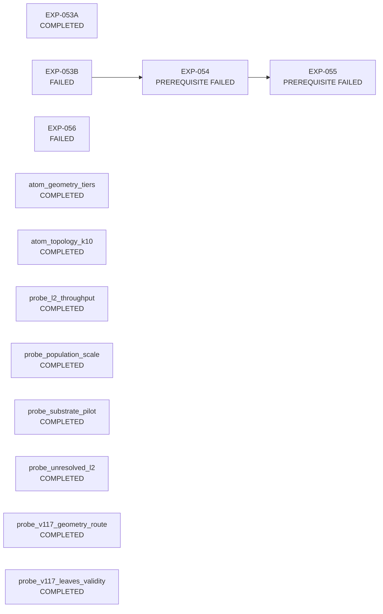

# Experiment reports

Generated by `scripts/build_reports.py` from every JSON under `results/`. Each row links to a report with provenance, gate, tables, figures and Neuroglancer views. Regenerate after any experiment writes a result.

| id | title | status | commit | commit date | elapsed | provenance | report |
|---|---|---|---|---|---:|---:|---|
| EXP-053A | EXP-053A checkpoint bake-off | COMPLETED (no gate) | [`87a594dc`](https://github.com/wrgr/neuronauts/commit/87a594dcc7a08c06069a40ff8c7a65da55540974) | — | 6.2 min | 35% | [report](EXP-053A.md) |
| EXP-053B | EXP-053B real-L2 candidate-panel recall | FAILED (gate not met) | [`13a7e286`](https://github.com/wrgr/neuronauts/commit/13a7e28642281fa8b636e11339fdd766e30a4c6e) | — | 9.9 min | 35% | [report](EXP-053B.md) |
| EXP-054 | EXP-054 fixed-panel scorer bake-off | PREREQUISITE FAILED (did not run) | [`32e41a03`](https://github.com/wrgr/neuronauts/commit/32e41a032994d5617361ef2aa6d6d0c1e9c0058d) | — | — | 35% | [report](EXP-054.md) |
| EXP-055 | EXP-055 conservative soma-seeded forest | PREREQUISITE FAILED (did not run) | [`6c5e3aac`](https://github.com/wrgr/neuronauts/commit/6c5e3aac03247c7bda4a1df46b783feccf2d195d) | — | — | 35% | [report](EXP-055.md) |
| EXP-056 | EXP-056 real-root atomization | FAILED (gate not met) | [`48718a8a`](https://github.com/wrgr/neuronauts/commit/48718a8a469686ba96ec67296c7f2be9f0dfb0af) | — | 3.1 min | 35% | [report](EXP-056.md) |
| atom_geometry_tiers | atom geometry tiers | COMPLETED (no gate) | — | — | — | 0% | [report](atom_geometry_tiers.md) |
| atom_topology_k10 | atom topology k10 | COMPLETED (no gate) | — | — | — | 0% | [report](atom_topology_k10.md) |
| probe_l2_throughput | probe l2 throughput | COMPLETED (no gate) | — | — | — | 0% | [report](probe_l2_throughput.md) |
| probe_population_scale | probe population scale | COMPLETED (no gate) | — | — | — | 0% | [report](probe_population_scale.md) |
| probe_substrate_pilot | probe substrate pilot | COMPLETED (no gate) | — | — | — | 0% | [report](probe_substrate_pilot.md) |
| probe_unresolved_l2 | probe unresolved l2 | COMPLETED (no gate) | — | — | — | 0% | [report](probe_unresolved_l2.md) |
| probe_v117_geometry_route | probe v117 geometry route | COMPLETED (no gate) | — | — | — | 0% | [report](probe_v117_geometry_route.md) |
| probe_v117_leaves_validity | probe v117 leaves validity | COMPLETED (no gate) | — | — | — | 0% | [report](probe_v117_leaves_validity.md) |

## How results feed each other

Edges come from the `provenance.input(s)` and `population` paths each result recorded. A failed prerequisite propagates: nothing downstream of a failed gate is a measurement.

## Provenance grading

A result is reproducible when it records the commit, whether the tree was dirty, a timestamp, hashed inputs, the command line, package versions and its synthetic-fallback flag. Older results recorded a commit and honesty flags only, so they grade partially; new scripts should call `neuronauts.report.write_result` to record the rest.
